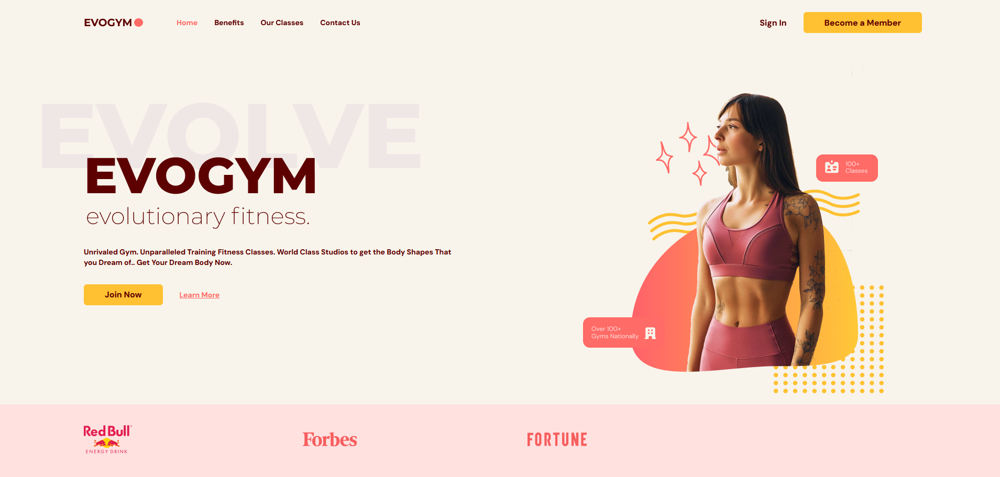

# EvoGym Fitness Website

EvoGym is a modern fitness website built with **Vite**, **React**, and **TypeScript**. This project showcases a dynamic landing page with an emphasis on user experience, featuring a clean and responsive design to highlight the benefits, services, and class offerings of EvoGym.



## 🚀 Technologies Used

- **Vite** - Fast build tool and development server for modern web applications.
- **React** - JavaScript library for building user interfaces.
- **TypeScript** - Strongly typed programming language that builds on JavaScript.
- **SCSS** - For modular and maintainable styling.

## 📋 Features

- **Responsive Design** - Seamless layout across devices, from mobile to desktop.
- **Navigation Bar** - Links for Home, Benefits, Our Classes, and Contact Us.
- **Hero Section** - Engaging call-to-action with "Join Now" and "Learn More" buttons.
- **Brand Logos** - Trusted by industry leaders like RedBull, Forbes, and Fortune.

## 🛠️ Getting Started

### Prerequisites

Ensure you have the following installed:

- **Node.js** (>= 14)
- **npm** (>= 6)

### Installation

1. Clone the repository:

   ```bash
   git clone <repository-url>
   ```

2. Navigate to the project folder:

   ```bash
   cd evogym
   ```

3. Install dependencies:

   ```bash
   npm install
   ```

4. Start the development server:

   ```bash
   npm run dev
   ```

   The application will be running at [http://localhost:5173](http://localhost:5173).

### Building for Production

To build the project for production, run:

```bash
npm run build
```

The output will be in the `dist` folder.

### Linting

This project uses **ESLint** for linting. Run the following command to check for linting issues:

```bash
npm run lint
```

## 🖌️ Customization

- **Styling**: Managed with SCSS. Modify styles in the `src/styles` folder.
- **Component Structure**: The project follows a React component-based structure using TypeScript interfaces.

## 💡 Contributing

Contributions are welcome! Please fork the repository and submit a pull request.

## 📝 License

This project is licensed under the **MIT License**. See the `LICENSE` file for details.
